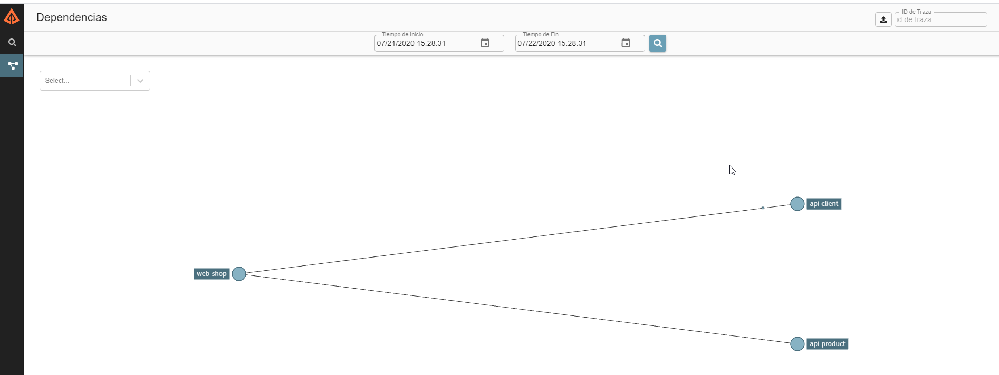

# Spring Cloud Sleuth
**Spring Cloud Sleuth** es una librería, proporciona por **Spring**, que implementa una solución de traceo distribuido. Con tan solo incluir la dependencia en nuestros micro servicios, dotamos al ecosistema de **un mecanismo automático** de identificación de peticiones, ya que añade varios campos útiles a las mismas para identificarlas. 

A partir de la versión 2.0.0, **Spring Cloud Sleuth** utiliza una librería de rastreo llamada [Brave](https://github.com/openzipkin/brave). Brave se encarga de agregar un identificador único a cada solicitud web que ingresa a nuestra aplicación y Spring le agrega el manejo multi hilo.

## Sleuth – Trace
Antes de pasar a analizar los identificadores que genera **Sleuth** tenemos que definir 2 conceptos:
* **Trace:** se pueden considerar como una sola solicitud o trabajo que se desencadena en una aplicación. Todos los diversos pasos en esa solicitud, incluso a través de los límites de la aplicación y el hilo, tendrán el mismo **traceId**.
* **Span:** pueden considerarse como secciones de un trabajo o solicitud. Una única traza (**trace**) puede estar compuesta por múltiples tramos (**span**), cada uno de los cuales se correlaciona con un paso o sección específicos de la solicitud. 
 
Mediante el uso de identificadores de **trace** y **span** podemos determinar exactamente cuándo y dónde está nuestra aplicación mientras procesa una solicitud.

Ahora veamos como se ve un mensaje de Sleuth por consola:

La parte importante para nosotros es:

Los datos que presenta **Sleuth** tienen el siguiente formato:
    
    [nombre de la aplicación, traceId, spanId, export]

* **Nombre de la aplicación:** este es el nombre que establecemos en el archivo de propiedades y se puede usar para agregar registros de varias instancias de la misma aplicación.
* **TraceId**: esta es una identificación que se asigna a una sola solicitud, trabajo o acción.  
* **SpanId:** rastrea una unidad de trabajo. Piense en una solicitud que consta de múltiples pasos. Cada paso podría tener su propio intervalo y ser rastreado individualmente. Por defecto, cualquier flujo de aplicación comenzará con el mismo **TraceId** y **SpanId**.
* **export:** esta propiedad es un valor booleano que indica si este registro se exportó o no a un agregador como **Zipkin**. 

## Trace – Entre Servicios
Bien, ya sabemos que es **Sleuth** y cuál es la estructura de mensaje, pero ¿cómo mantiene la traza entre servicios?

Las trazas se conectan de un servicio a otro utilizando la propagación de encabezado. El formato predeterminado es [B3](https://github.com/openzipkin/b3-propagation). De manera similar a los formatos de datos, también puede configurar formatos de encabezado alternativos, siempre que las ID de rastreo y extensión sean compatibles con **B3**. En particular, esto significa que el ID de rastreo y los ID de intervalo son hexadecimales en minúsculas, no UUID. Además de los identificadores de rastreo, también se pueden pasar otras propiedades (**baggage**) junto con la solicitud.

Veamos un ejemplo de una propagación de encabezado:

**Sleuth** configura todo lo que necesita para comenzar a rastrear. Configura donde se informa los datos de rastreo (**spans**), cuantos rastreos mantener(**sampling**), si se envían campos remotos (**baggege**) y que librerías se rastrean.

## Dependencias
Para incluir Sleuth en nuestro proyecto String lo único que tenemos que hacer es incluir la siguiente dependencia en nuestro proyecto:

_Ejemplo maven_

    <dependency>
		<groupId>org.springframework.cloud</groupId>
		<artifactId>spring-cloud-starter-sleuth</artifactId>
	</dependency>

_Ejemplo gradle_

	compile group: 'org.springframework.cloud', name: 'spring-cloud-starter-sleuth'

Del resto se encarga Spring.

Al agregar esta dependencia solo estaremos dotando a nuestro proyecto con la capacidad de generar una trazabilidad sobre una solicitud, aunque esto no es poca cosa, si queremos conectar esto con productos como Zipkin, las dependencias a utilizar son otras. 

> Recordad que para para poder visual la traza tendremos que estar logeando algo.

## Interacción entre servicios con Sleuth

A modo de ejemplo se deje una gráfica de cómo se vería la interacción entre de servicios cuando se agrega Sleuth a nuestros proyectos.

# Zipkin
**Zipkin** es un sistema de rastreo distribuido, que nos ayuda a recopilar datos de los tiempos de ejecución de nuestros servicios. 

La información que obtenemos al utilizar **Zipkin** es de suma utilidad para solucionar la latencia en la comunicación entre los micro servicios.

Apenas entramos a **Zipkin** nos muestra un **dashboard** con información de alto nivel de los servicios que se ejecutaron en los últimos 15 minutos.

En la imagen, podemos apreciar cómo se visualiza la ejecución de 2 solicitudes del servicio **Web-Shop**. Si bien la información que nos presenta este primer **dashboard** es de alto nivel, un dato que nos puede ser de utilizad es la duración de la solicitud.

Si hacemos click sobre el nombre del servicio (En este caso WEB-SHOP), se nos presentara la información detallada de la ejecución de la solicitud seleccionada.

Es importante notar la forma en que se visualiza el histórico de interacciones entre servicios.

Otra vista que nos puede ser de utilizada, es la de **Dependencias**. Aquí podremos ver la dependencia que tienen nuestros servicios.

## Montando nuestro server Zipkin

La que considero más rápida para iniciar con las pruebas de **Zipkin** es ejecutando una instancia **docker**.

Dejo los comandos que se pueden usar para ejecutar nuestro primer server **Zipkin**

> docker pull openzipkin/zipkin
>
> docker run -d -p 9411:9411 openzipkin/zipkin

# Sleuth y Zipkin 

Bueno ahora que tenemos una noción de lo que es **Zipkin**, veamos cómo lo podemos integrar con **Sleuth**.

Por suerte como casi todo en **Spring** nos viene casi todo configurado, siendo nuestra responsabilidad solamente agregar las dependencias en nuestro proyecto y configurar nuestro archivo properties o yml.

Antes de ver las dependencias, sería útil comentar las 2 formas que tengo de comunicarme con Zipkin

* Directamente por http.
* Atreves de algún gestros de mensaje como Kafka o RabbitMQ.

> Nota: la comunicación por http, se recomienda para ambientes no productivos.

Como en esta instancia solo queremos mostrar cómo se integran estos 2 productos, iremos por el camino más corto. Nos integraremos mediante el protocolo http.

## Dependencias

Sin más prologo veamos que dependencia tenemos que agregar en nuestro proyecto. 

**_Ejemplo maven_**

    <dependency>
        <groupId>org.springframework.cloud</groupId>
        <artifactId>spring-cloud-starter-zipkin</artifactId>
	</dependency>

**_Ejemplo gradle_**
    
    compile group: 'org.springframework.cloud', name: spring-cloud-starter-zipkin

Si en nuestro Proyecto tenemos agregada la dependencia de **Sleuth** la tendremos que remplazar por las de **Zipkin**, ya que la librería de **Zipkin** incluye la librería de **Sleuth**.

## Configuración de propiedades

Para poder conectarnos con nuestro servidor **Zipkin**, lo único que tenemos que configurar es la url del mismo en nuestro archivo **application.properties** o **application.yml**

    spring:
        zipkin:
            baseUrl: http://localhost:9411/

Si bien se pueden realizar muchas más configuraciones, esta fuera del alcance de este documento exponerlas a todas.
